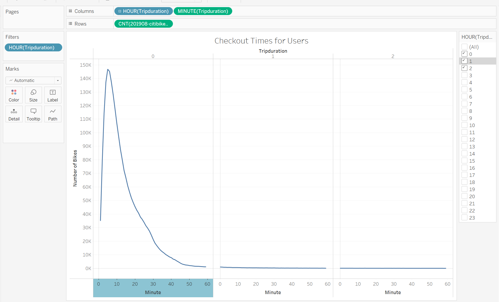
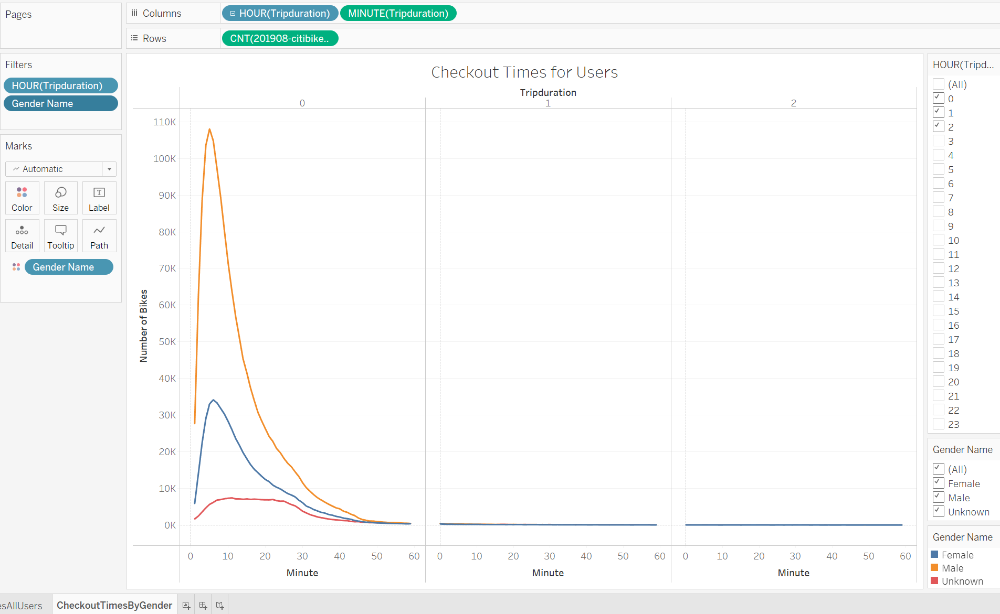
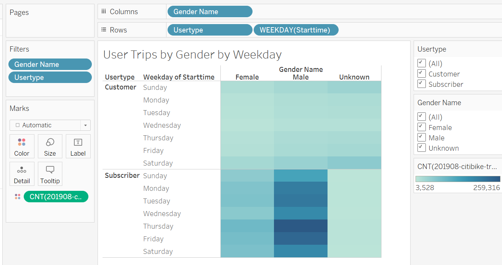
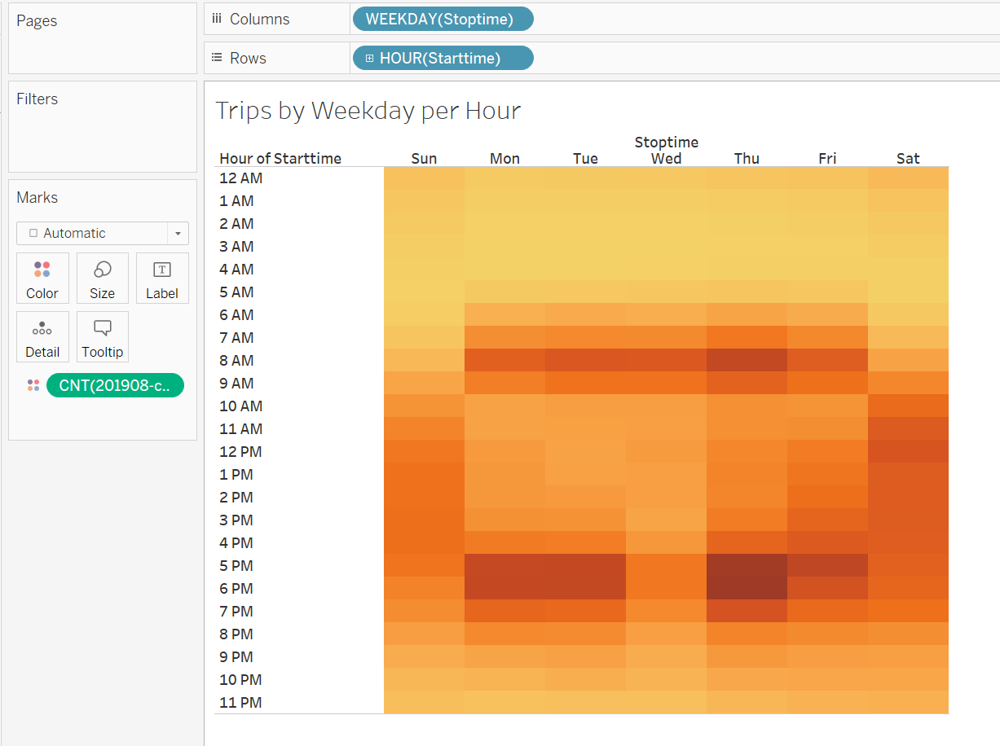
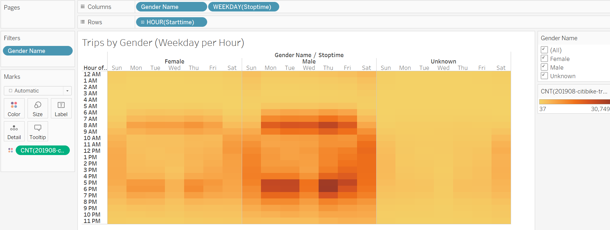

# bikesharing

## Overview/Purpose
  The purpose of this analysis was to present data from New York City's citibike usage to explore the possibility of intializing a similar bike-sharing venture in Des Moines, Iowa. Using a csv file from August 2019 data available on the citibike site, we were able to create visualizations to identify trends and patterns using Tableau. 

## Results

First, the csv file was modified by converting the 'Trip Durations' data type into the datetime format using Jupyter Notebook. 

The Tableau story can be found here [link to dashboard](https://public.tableau.com/app/profile/brittani7429/viz/Citibike_16631179420650/BikeRentalStory?publish=yes)

The first chart displays the overall trip duration. The steep right-skewed distirbution that the bike trip durations show that more commonly the bike rides are shorter. The average bike ride is around 5 minutes, indicating that the riders do not have extremely long trips to take but that there are many people taking trips at that length. 

Next we drilled down to determine the differences in bike trip durations by gender. The three categories indicate male, female and unknown. 

With our focus still on gender, we utilized a heat map to show the correlation between genders, and the specific days of the week that are most popular for bike usage.

The heaviest bike usage for all users is indicated on the heat map below. The y-axis indicates specific times of day, and the x-axis indicates which day of the week. The deeper the color on the heat map, the more frequent the bikes are used in that time frame.  

Again, we drilled down to determine the differences in user trip times per hour/day by gender. The similarities are noted in by the colors nearly matching regardless of gender. 

The next area graph in the Tableau story distinctly shows the most popular bike rental hours of the day. 

Finally the last charts in the story are two combined maps indicating the most popular pick-up and drop-off locations for the bikes.

 

## Summary
  The data graphics show a couple of identified trends. We can see that a majority of the subscribers to the bike rental app are male gendered. That might impact how the marketing and advertisements can be targeted for maximum impact. The typical length of a bike ride in NYC was 5 minutes, regardless of gender. This might indicate that the users are taking quick trips, more out of convenience than leisure/fun. There are multiple graphical representations that show the most popular times to rent a bike, as well as the most popular day of the week. The gender patterns for these popular times/days are aligned as well, neither gender shows a significantly different trend. The representation of the most common starting locations and ending locations can tell us one of two things; either the users are taking round trips (so the start and end locations are the same), or the users are making two different trips in the same day. For example, to and from work. We can see an interesting difference between weekday rental times and weekend rental times on our heat maps. During the week, the most popular times are before and after work, around 8am and 5-6pm. On the weekends the usage is overall lower, but shows a more even spread during the daylight hours. 
  
  A suggestion for additional research would be to compare and contrast the weekday usage with the weekend use to determine if this business venture would be more profitable during the week or on the weekends. I would specifically be interested in seeing the length of rides during the weekend compared to during the week. Shorter more frequent trips are taken during the week, but less frequent, longer trips on the weekend would still be cost-effective for this business since the rental charges are based on distance traveled. Another feature to highlight with this data is the difference between the age groups and overall use of the rentals. This could help target marketing and advertisements, similar to gender differences.  
